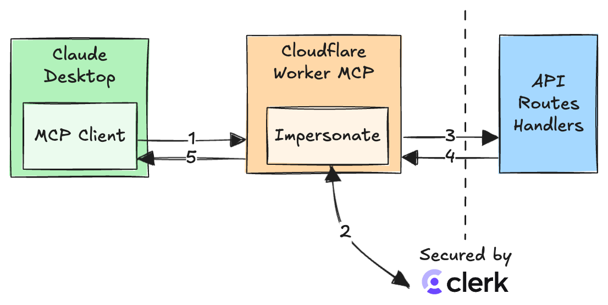

# workers-mcp-clerk

Talk to a Cloudflare Worker from Claude Desktop proxying Clerk protected API Routes or server actions.

## How it works

For every application that uses Clerk for authentication, you can create a Cloudflare Worker that acts as an MPC Server and impersonates a Clerk user.

## How to use

1. Deploy and install the Cloudflare MCP server to Claude Desktop using the instructions [here](https://github.com/cloudflare/workers-mcp).
2. Open Claude Desktop and type "Say hello to hello@mysite.com"
3. For demo purposes, the Cloudflare Worker will impersonate the Clerk user, return with a greeting and a user JWT. In a real scenario, the JWT will be used to request Clerk protected API Route or server actions.
